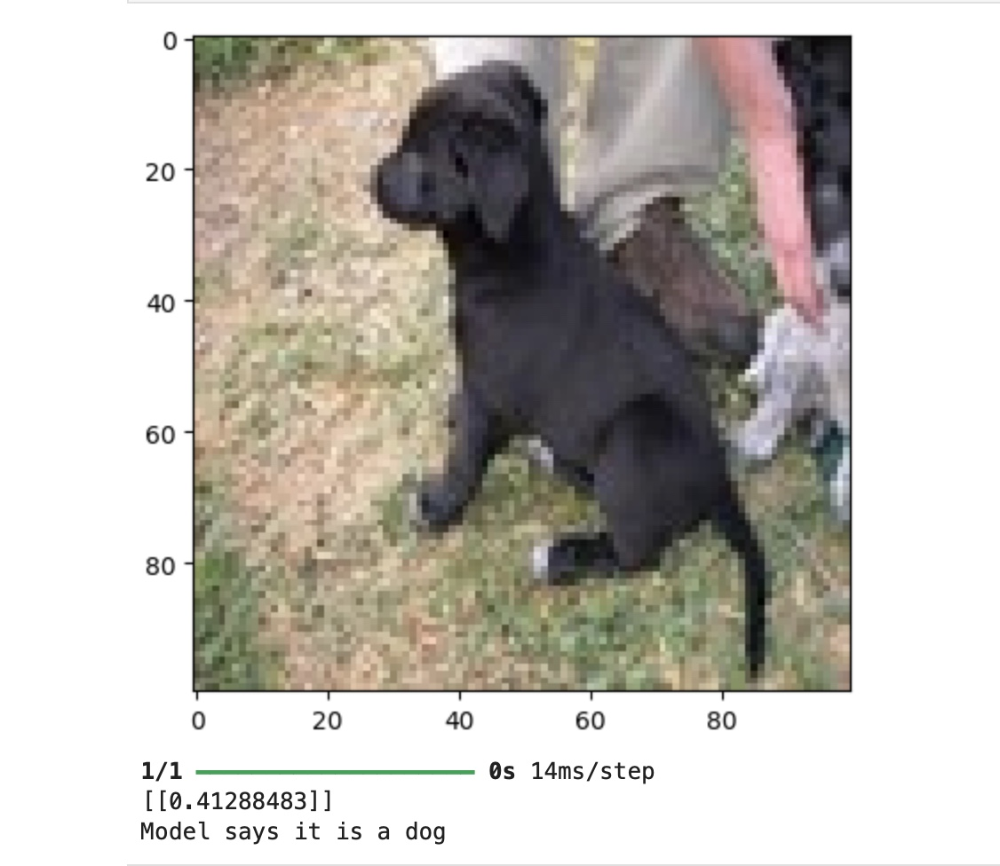

# Image-Classification-Dogs-vs-cats-using-CNN
This project demonstrates a complete machine learning pipeline for image classification. It features a Convolutional Neural Network (CNN) built with TensorFlow and Keras to distinguish between cats and dogs based on a dataset of 2,000 images.

# Key Features

- Custom CNN Architecture: The model consists of three convolutional blocks (32, 64, and 128 filters) using Conv2D and MaxPooling2D for deep feature extraction.
- Advanced Regularization: Implemented a Dropout (0.5) layer to prevent overfitting, ensuring the model generalizes well to new, unseen data.
- Data Preprocessing: Images were reshaped to 100 x 100 x 3 (RGB) and normalized by scaling pixel values to a [0, 1] range for faster convergence.

# Model Performance
The final model was trained for 15 epochs, reaching a stable learning state:

- Training Accuracy: 91.14%
- Test Accuracy: 68.50% (evaluated on 400 test images)
- Loss Reduction: Successfully reduced training loss to 0.1848

# Technologies and Frameworks

- Python 3.9: Used for the overall project structure and automation.
- TensorFlow and Keras: Primary frameworks for building the Sequential CNN model.
- NumPy: Employed for efficient handling of the image datasets.
- Matplotlib: Utilized to visualize model predictions and verify input data.
- Jupyter Lab: Interactive development environment used for training and testing.

# Engineering Challenges and Solutions

- Model State Management: Resolved NameError and ValueError issues by ensuring strict sequential execution of model definition, compilation, and training.
- System Optimization: Configured the environment to run efficiently on macOS hardware.

# How to Run
1. Clone this repository.
2. Ensure you have Python 3.9 and TensorFlow installed.
3. Open model.ipynb in Jupyter Lab.
4. Run all cells to see the training process and final predictions.

